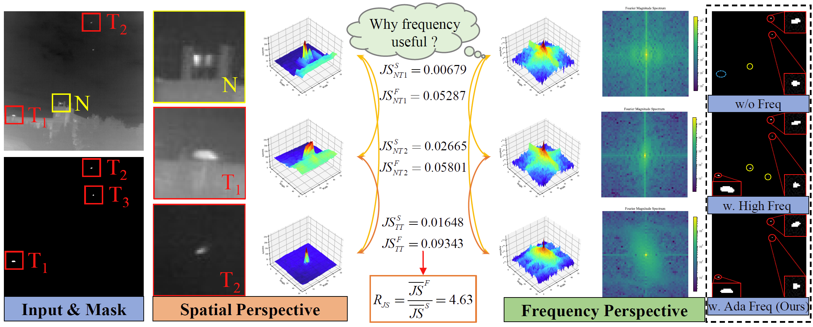
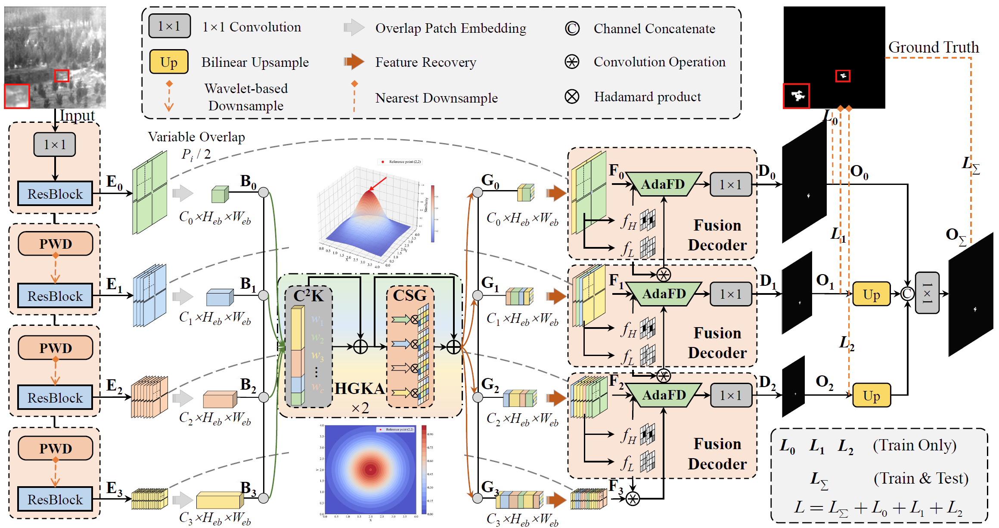
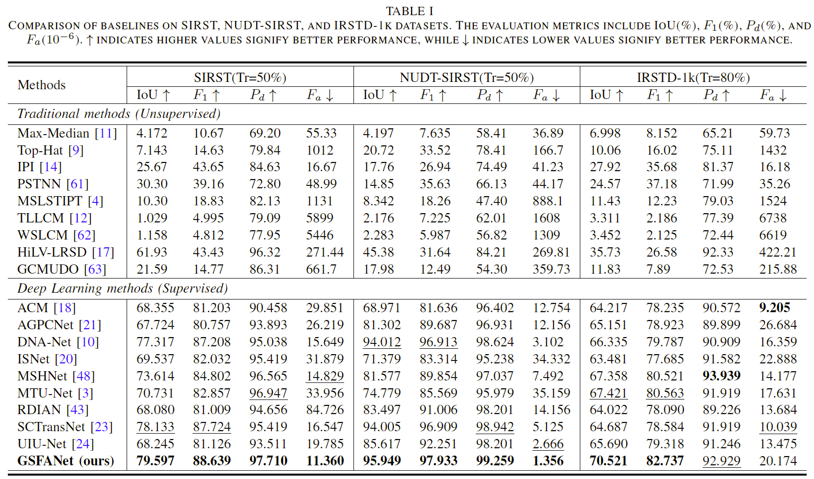
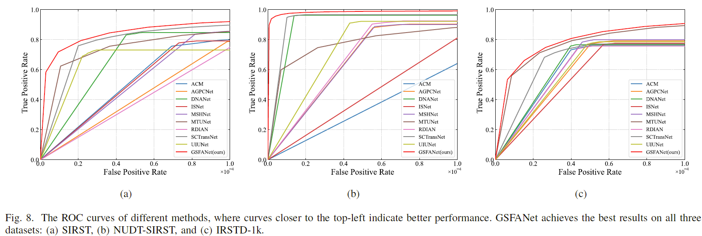

# *<center>GSFANet: Global Spatial-Frequency Attention Network for Infrared Small Target Detection</center>*

This repository contains the algorithm done in the
work [GSFANet: Global Spatial-Frequency Attention Network for Infrared Small Target Detection](https://github.com/dengfa02/GSFANet_IRSTD)
by Chuiyi Deng et al. 

**Update**:Thanks to the efforts of the editor and all the reviewers, our work has been accepted by `IEEE TGRS 2025`.
If you find this paper helpful and inspiring, please cite the following format:
```
@article{GSFANet,
  author = {Chuiyi Deng, Zhuoyi Zhao, Xiang Xu, Yixin Xia, Junwei Li, Antonio Plaza},
  title = {GSFANet: Global Spatial-Frequency Attention Network for Infrared Small Target Detection},
  journal = {TGRS},
  year = {2025},
}
```

## Motivation


## Structure and Results




## Domains

**requirements**: The code should be directly runnable with Python 3.x+ and torch 1.x+. The older versions of Python are no longer supported.

Scipy error may be displayed during runtime, just update it to the latest version (e.g. 1.11.2).

`einops -> 0.8.0`
`pywavelets -> 1.5.0`

**Dataset**: SIRST-v1 [Download](https://github.com/YimianDai/sirst) //
NUDT-SIRST [Download](https://github.com/YeRen123455/Infrared-Small-Target-Detection) //
IRSTD-1K [Download](https://github.com/RuiZhang97/ISNet) //

**Weights**: 

[Weight](weight/NUAA-SIRST/weight-NUAA-SIRST.pkl/) for SIRST 

[Weight](weight/NUDT-SIRST/weight-NUDT-SIRST.pkl/) for NUDT-SIRST 

[Weight](weight/IRSTD-1k/weight-IRSTD-1k.pkl/) for IRSTD-1k


## Usage
* Run `train.py` to perform network training. It should be noted that since the size of the IRDST dataset has been doubled,the 'patch_size' in GSFANet also needs to be expanded by a factor of 2 to [64, 32, 16, 8]. Example for training GSFANet on 'NUDT-SIRST' datasets:
  ```
  $ cd ./GSFANet
  $ python train.py --dataset 'NUDT-SIRST'
  ```
* Modify the ['mode'] to ['test'] in `train.py` for model validation. Example for testing GSFANet on 'NUDT-SIRST' datasets:
  ```
  $ cd ./GSFANet
  $ python train.py --dataset 'NUDT-SIRST'  --mode 'test'
  ```
* Checkpoints and Logs will be saved to `./weight/['dataset']/`.

## Acknowledge

*This code is highly borrowed from [IRSTD-Toolbox](https://github.com/XinyiYing/BasicIRSTD). Thanks to Xinyi Ying.

*This code is highly borrowed from [SCTransNet](https://github.com/xdFai/SCTransNet). Thanks to Shuai Yuan.

*This code is highly borrowed from [MSHNet](https://github.com/Lliu666/MSHNet). Thanks to Qiankun Liu.

